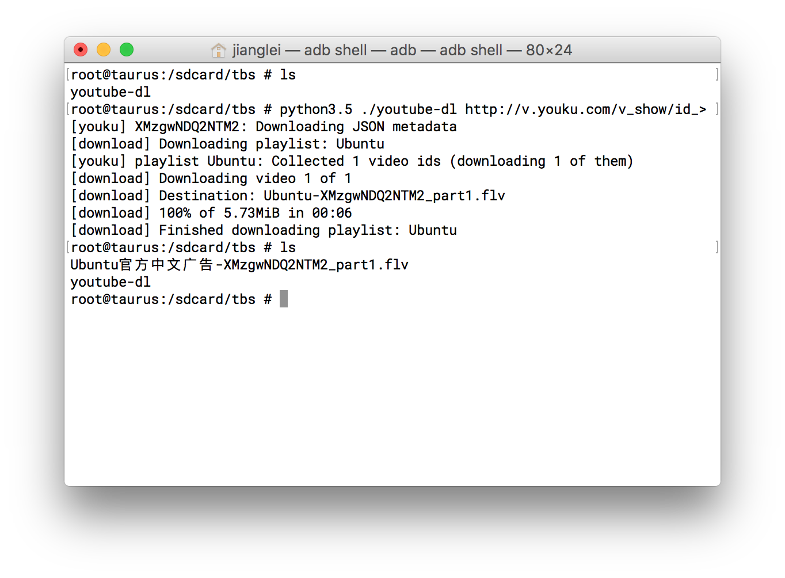

# How to use

From now on, you can use youtube-dl on android directly.

#### 1.Preparation

push bin/python3.5 to /system/bin.

push lib/python3.5 to the default folder of python(default is /system/bin/lib/python3.5).

push bin/youtube-dl to /sdcard

#### 2.execute

cd the folder of youtube-dl, and copy the video link. In termial:

```shell
python3.5 ./youtube-dl https://www.youtube.com/watch?t=4&v=BaW_jenozKc
```

Then you will get the video.

#### 3.test

