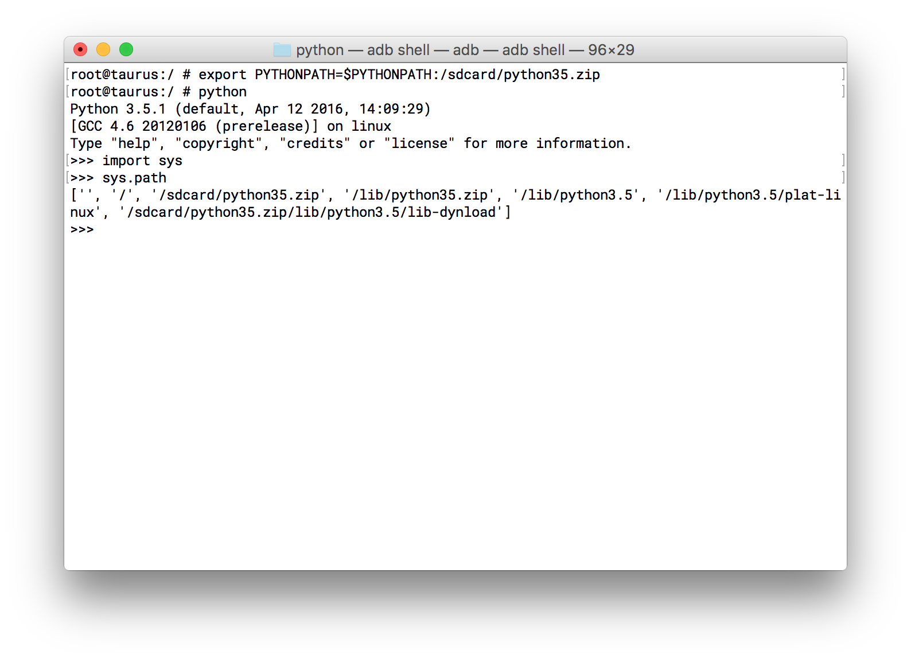
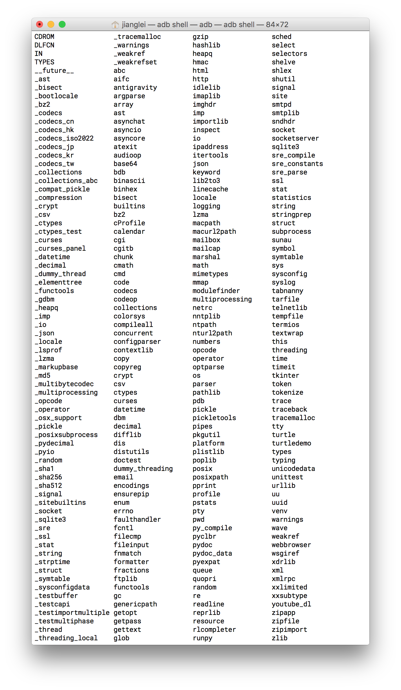

## Python for android

This project is based on the version 3.5.1 of python. I have made some changes to the source code The specific steps for compile are as follows:

#### 1.Preparation

- cross compiler toolchain was exported by ndk.


- ubuntu15.10 x64.

- bionic does not localeconv(), you should copy the locale header and shared library to the toolchain sysroot/usr/include and sysroot/usr/lib. 


#### 2.Compile

We shoud compile the source code under pc and android, because we need the executables pgen and _freeze_importlib which compile under PC. Unfortunately, i modify some source code, so this project could not be compiled for PC. 

- build pc.

  get the source code from https://www.python.org/downloads/release/python-351/, then build 

  ```shell
  ./configure && make
  ```
  Or use the prebuilt executables, pgen and _freeze_importlib.

- cross compile

  ```shell
  ./configure  --build=x86_64-linux-gnu --host=arm-linux-androideabi --disable-ipv6 CONFIG_SITE=config.site --prefix=/system/
  ```

- Modify the Setup file under folder Modules to specify the modules should be compiled.


- Then you'll get errors，According to the errors, you may need to copy the executable pgen or _freeze_importlib which compile under PC to the right folder , and they under folder Parser or Programs. Do not forget to modifiy the time of each file. 

  ```shell
  touch ./Parser/pgen 
  #Or
  touch ./Programs/_freeze_importlib
  ```

  The continue compiling.

- make install DESTDIR=/path/to/you/like

####3.Compiled

- Once compiled successfully，you can reduce the volume of executable use strip command. Like this:

  ```shell
  arm-linux-androideabi-strip python3.5
  ```

- Delete the static library if you don't need it.

- You can compress the standard library which under the directory of lib/python3.5 (use zip), and then put the compressed zip(python35.zip) file in the right place(may be under /system/lib/python3.5/). Or just put the zip to sdcard  and export the PYTHONPATH when used. If you doesn't compress the library, put the library folder under /system/lib/. You shouldn't put the uncompressed library to sdcard because android doesn't support load shared library from sdcard. But you can push the compressed library to sdcard. 

####4.Test

- if you use the library was compressed, you may need to set PYTHONPATH for python.

  


- supported modules

  
